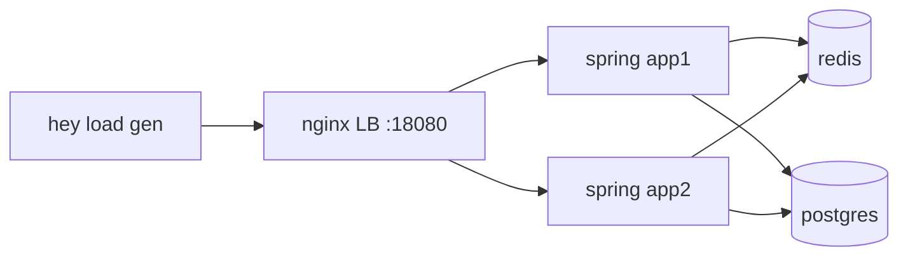
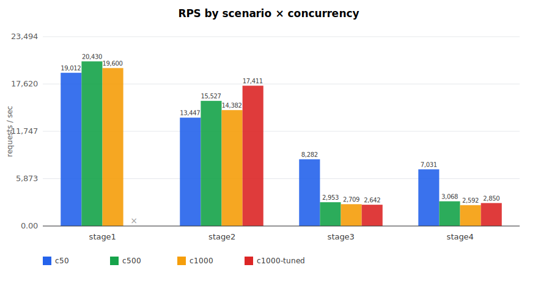
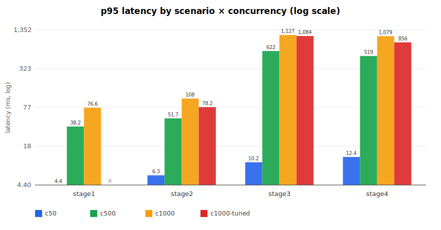
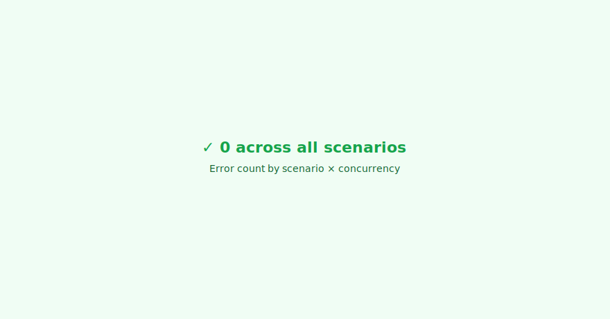

# scaling-foundations

책 1·2·3장 (규모 확장성 기초 · 개략적 규모 추정 · 시스템 설계 면접) 실습. 이론·메타 챕터이므로 **세 개의 작은 lab** 으로 구성한다.

| Lab | 책 장 | 형태 | 목적 |
|---|---|---|---|
| [lab1-horizontal-scaling](lab1-horizontal-scaling/) | 1장 | Spring Boot + Docker Compose 4단계 | "단일 서버 → 외부 DB → 로드밸런서 + 복제 → 캐시" 단계별로 실제 부하를 걸어 RPS·p95 변화 측정 |
| [lab2-capacity-estimator](lab2-capacity-estimator/) | 2장 | Java CLI | DAU·요청수·페이로드·보관년수 입력 → QPS / 저장용량 / 대역폭 산출. 책의 치트시트 (지연시간·가용성·2의 제곱수) 내장 |
| [lab3-interview-framework](lab3-interview-framework/) | 3장 | 문서 | 4단계 면접 프레임워크를 이 저장소의 챕터 워크플로우와 매핑한 치트시트 |

## 스택

- **언어/프레임워크**: Java 17 + Spring Boot 3.3 (lab1, lab2)
- **인프라 (lab1)**: PostgreSQL 16, Redis 7, Nginx 1.27 (LB)
- **벤치 도구**: [hey](https://github.com/rakyll/hey) — 단일 바이너리, GET/POST 부하 생성, p50·p95·p99 출력

## 요구사항 정의 (lab1 한정)

이 챕터에서 "구현 대상" 은 lab1 입니다. 1장의 단일 서버 진화를 직접 경험하기 위한 실험용 앱이며, 도메인은 의도적으로 단순합니다.

### 기능 요구사항

- `POST /api/items` — 아이템 생성 (`{id, name}`)
- `GET /api/items/{id}` — 단일 아이템 조회 (반복적으로 호출되는 hot path)
- `GET /health` — 인스턴스 ID 응답 (어느 replica 가 응답했는지 확인용)

### 비기능 요구사항

- 단일 노드 대비 stage4 에서 **읽기 RPS 2배 이상**, p95 절반 이하 달성을 목표로 한다.
- 모든 단계가 동일한 부하 시나리오 (`hey -z 30s -c 50`) 로 비교 가능해야 한다.
- 데이터 일관성은 **읽기 시점 최대 60s 지연 허용** (캐시 TTL).

### 명시적 비범위

- 인증/인가, HTTPS, 운영 모니터링
- 데이터베이스 복제, 샤딩 (책의 후반부 키-값 저장소 챕터에서 다룸)
- 자동 스케일링, 헬스체크 기반 트래픽 차단

## 개략적 규모 추정 (가상 시나리오)

가상 시나리오로 lab2 의 계산기를 검증하기 위한 입력값.

| 항목 | 값 | 산출 근거 |
|---|---|---|
| DAU | 1,000,000 | 가정 |
| 사용자당 일 조회 | 10 | 가정 |
| 평균 QPS | ~115 | 1e6 × 10 / 86400 |
| 피크 QPS | ~345 | 평균 × 3 |
| 아이템당 평균 크기 | 200 B | id+name+views |
| 1년 신규 아이템 | 1억 | 가정 |
| 저장 용량 (1년) | ~20 GB | 1e8 × 200 B |

(같은 값을 lab2 의 CLI 로도 재계산하며 검증한다.)

## 상위 설계 — lab1 의 stage4 (최종 형태)



stage 별 포함 컴포넌트:

| 단계 | 포함 | 메모 |
|---|---|---|
| stage1 | app1 (in-memory `ConcurrentHashMap`) | 단일 프로세스, 외부 의존 0 |
| stage2 | app1 + postgres | 상태 외부화 |
| stage3 | nginx + app1 + app2 + postgres | LB 뒤 stateless 복제 |
| stage4 | nginx + app1 + app2 + postgres + redis | 캐시 추가 |

## MVP 및 확장 실험

- **MVP** = stage1 (HashMap 단일 인스턴스)
- **실험 1** = stage2 — 상태를 PostgreSQL 로 외부화
- **실험 2** = stage3 — Nginx + app 2개 로 수평 확장
- **실험 3** = stage4 — Redis 캐시로 hot read 가속

## 포트 맵

| 서비스 | 내부 포트 | 외부 포트 |
|---|---|---|
| nginx (LB) | 80 | 18080 |
| app1 | 8080 | 18081 |
| app2 | 8080 | 18082 |
| postgres | 5432 | 15432 |
| redis | 6379 | 16379 |

다른 챕터와 충돌을 피해 `18000` 대역을 점유한다.

## 환경 변수 (`.env`)

| 변수 | 설명 | 예시 값 | 사용처 |
|---|---|---|---|
| `POSTGRES_USER` | DB 사용자 | `scaling` | postgres, app |
| `POSTGRES_PASSWORD` | DB 비밀번호 | `scaling` | postgres, app |
| `POSTGRES_DB` | DB 이름 | `scaling` | postgres, app |
| `STAGE` | 현재 실행 stage (1\|2\|3\|4) — Makefile 이 사용 | `4` | Makefile, compose |

`docker-compose.yml` 은 단일 파일이며 Compose **profiles** 로 stage 별 서비스 집합을 토글한다. Spring 앱의 모드(`STORAGE_MODE`, `CACHE_ENABLED`) 도 같은 stage 변수로부터 파생된다.

## 실행 방법

```bash
# 0. .env 준비 (최초 1회)
cp .env.example .env

# 1. 단계별 기동
make stage1   # HashMap 단일
make stage2   # +postgres
make stage3   # +nginx, app2 (LB+복제)
make stage4   # +redis (캐시)

# 2. 단계 정리
make down

# 3. 벤치마크 (현재 떠 있는 stage 에 대해)
make bench

# 4. 4단계 전체 자동 벤치
make bench-all

# 5. 보조 실험 — HikariCP pool 100 으로 stage2/3/4 재벤치
make bench-tuned
```

`make stage<n>` 은 내부적으로 `COMPOSE_PROFILES=stage<n> docker compose up -d` + 적절한 환경 변수 설정을 수행한다.

`HIKARI_POOL_SIZE` 환경 변수로 HikariCP 풀 크기를 오버라이드할 수 있다 (기본 20):

```bash
HIKARI_POOL_SIZE=100 make stage3   # stage3 을 풀 100 으로 기동
```

## 벤치마크 결과

부하: `hey -z 30s -c {50,500,1000} http://localhost:<port>/api/items/seed-1` (사전에 `seed-1` 1건 POST). 동일 머신, 워밍업 5초. 원시 결과는 [bench-results/c{50,500,1000}/stage{1..4}.txt](bench-results/).

### 가설 (실험 전)

| # | 가설 | 조건 |
|---|---|---|
| H1 | stage1 이 가장 빠르고, stage2 에서 DB 왕복으로 느려졌다가, stage3 에서 처리량이 회복되고, stage4 에서 캐시 히트로 stage1 수준에 근접한다. | c=50 |
| H2 | 동시성을 올리면 단일 JVM(stage1) 이 먼저 포화되고, stage3/4 가 역전해 책의 진화 경로가 "이득" 으로 증명된다. | c=500, c=1000 |
| H3 | stage4 의 Redis 캐시는 stage3 의 postgres 왕복을 제거해 p95 가 절반 이하로 떨어진다. | c=500, c=1000 |

### 실제 수치

#### c = 50

| 시나리오 | RPS | p50 (ms) | p95 (ms) | p99 (ms) | 에러 |
|---|---:|---:|---:|---:|---:|
| stage1 (HashMap 단일) | **19,012** | 2.4 | 4.4 | 6.3 | 0 |
| stage2 (+postgres) | 13,447 | 3.4 | 6.3 | 8.8 | 0 |
| stage3 (LB + 2 replicas) | 8,282 | 5.6 | 10.2 | 14.2 | 0 |
| stage4 (+redis cache) | 7,031 | 6.3 | 12.4 | 21.2 | 0 |

#### c = 500

| 시나리오 | RPS | p50 (ms) | p95 (ms) | p99 (ms) | 에러 |
|---|---:|---:|---:|---:|---:|
| stage1 (HashMap 단일) | **23,637** | 19.2 | 35.1 | 52.9 | 0 |
| stage2 (+postgres) | 17,629 | 25.3 | 46.2 | 77.8 | 0 |
| stage3 (LB + 2 replicas) | 8,096 | 26.7 | 170.7 | 978.2 | **4,428 EOF** |
| stage4 (+redis cache) | _incomplete_ | — | — | — | **11,594 EOF** |

#### c = 1000

| 시나리오 | RPS | p50 (ms) | p95 (ms) | p99 (ms) | 에러 |
|---|---:|---:|---:|---:|---:|
| stage1 (HashMap 단일) | **24,311** | 37.4 | 57.7 | 198.7 | 0 |
| stage2 (+postgres) | 16,528 | 54.1 | 91.7 | 170.5 | 0 |
| stage3 (LB + 2 replicas) | 5,392 | 40.8 | 642.2 | 1,743.2 | **8,099 EOF** |
| stage4 (+redis cache) | 4,711 | 34.3 | 453.3 | 1,808.8 | **17,117 (EOF + timeout)** |

### 가설 vs 실제

| 가설 | 결과 | 메모 |
|---|---|---|
| **H1** (c=50 에서 정방향 이득) | ❌ **기각** | 모든 단계 전이가 역방향 (stage1 19k → stage4 7k, **-63%**) |
| **H2** (고부하에서 역전) | ❌ **기각** | c=1000 에서도 stage1 이 여전히 최고 RPS. stage3/4 는 **EOF 에러로 붕괴** |
| **H3** (Redis 가 p95 절감) | ❌ **기각** | stage4 는 모든 동시성에서 stage3 보다 p95 악화 |
| **신규 관찰 H4** | ✅ | **stage1(JVM 단독) 은 c=1000 까지 에러 0 으로 선형 확장** — 단일 프로세스가 먼저 포화되는 가정 자체가 틀렸음 |
| **신규 관찰 H5** | ✅ | **nginx 를 포함한 stage3/4 에만 EOF 에러 집중** — 새 병목은 앱이 아니라 LB |

### 병목의 정체 (에러 분석)

c=500 / c=1000 에서 **nginx 를 경유하는 stage3·stage4 에만** EOF 에러가 집중됐습니다. 패턴:

- 에러 타입: `Get "...": EOF` — 서버가 연결을 먼저 끊음 (client 가 response 를 받기 전)
- 에러 수: stage3 (4,428 / 8,099) → stage4 (11,594 / 17,117). **stage4 가 stage3 보다 항상 더 많다**
- 비(非)nginx 인 stage1/2 는 같은 동시성에서 **에러 0**

원인 가설 (사용자 확인 전):

1. **nginx `upstream` 에 `keepalive` 미설정** → 모든 요청이 새 TCP 연결. nginx-to-app 커넥션 소켓이 `TIME_WAIT` 에 누적되어 pool 소진 시 upstream 이 RST/FIN 으로 응답
2. **nginx 기본 `worker_connections 512`** → c=1000 일 때 worker 당 한계 근처
3. **stage4 가 stage3 보다 에러가 더 많은 이유** = Redis 왕복이 요청당 평균 지연시간을 더 늘려 nginx 가 앞쪽 커넥션을 더 오래 붙잡고 있음 → 1·2 의 병목이 더 빨리 터짐

**즉, 이 실험이 드러낸 가장 중요한 사실은 "스케일 아웃 경로를 따라가면 병목이 앱에서 LB 로 이동한다" 는 점입니다.** 책 1장은 이 병목 이동을 암시하지만, 측정으로 보여주지는 않습니다.

> stage3 이후는 **nginx 튜닝(확장 실험 5 후보)** 이 없으면 의미가 없습니다. 다음 섹션 "다음에 시도할 것" 에 구체적 튜닝 안을 기록합니다.

### 차트

`make viz` 로 `bench-results/charts/` 에 SVG 차트를 생성합니다. 생성된 차트는 이 섹션에 임베드됩니다:





## 보조 실험 — HikariCP 어드미션 컨트롤 가설

c=1000 재벤치 (nginx keepalive 수정 후) 에서 직관에 반하는 현상이 관찰됐다: **stage3 이 stage4 보다 p50 기준 약 47% 더 빠르다**. Redis 캐시 hit 가 100% 인데도 stage4 의 중앙값이 더 높다.

- [CONTEXT.md §9 — c=1000 에서의 역전](CONTEXT.md) 에 히스토그램/해석 상세

### 가설

**HikariCP `maximum-pool-size: 20` 은 "작은 병목" 이 아니라 "어드미션 컨트롤" 로 작동한다.** 풀 한도가 있는 stage3 은 과부하 시 명시적 큐잉으로 DB 부하를 조절하지만, 풀 한도가 없는 Redis 경로 (stage4) 는 1000 스레드가 모두 동시에 Lettuce/Redis 에 경쟁해서 전 구간이 고르게 포화된다.

### 실험 설계

HikariCP 풀을 **20 → 100** 으로 5배 확장한 뒤 c=1000 으로 stage2/3/4 재벤치. 가설이 맞다면:

| stage | RPS 예상 | p95 예상 | 해석 |
|---|---|---|---|
| 2 (단일 replica, pool 20→100) | 미세 상승 | 평탄 또는 약간 악화 | 단일 JVM 이라 풀 경쟁 적음 |
| **3 (+LB+복제, pool 20→100)** | **상승** 또는 동일 | **악화** (보호 약화) | **가설의 핵심 예측**: RPS 개선 효과보다 p95 악화가 더 눈에 띔 |
| 4 (+redis, pool 20→100) | 변화 작음 | 변화 작음 | 이미 Redis 경로가 주된 병목이라 풀 변경 영향 적음 |

만약 가설이 **틀리면**: stage3 의 RPS 와 p95 모두 개선된다 → 풀이 정말로 "작은 병목" 이었고 키우는 게 정답이었다는 뜻

### 실행

```bash
make bench-tuned
```

내부적으로: `HIKARI_POOL_SIZE=100 CONCURRENCY=1000` 으로 stage2/3/4 를 순회 재벤치, 결과를 `bench-results/c1000-tuned/stage{2,3,4}.txt` 에 저장. `summarize.py` 가 `c1000-tuned` 를 네 번째 동시성 그룹으로 인식해 차트에 자동 포함.

### 결과 (c = 1000)

| stage | baseline RPS | tuned RPS | Δ RPS | baseline p50 | tuned p50 | baseline p95 | tuned p95 |
|---|---:|---:|---|---:|---:|---:|---:|
| 2 (단일 replica) | 14,382 | **17,411** | **+21%** ⬆ | 59.0 | 52.1 ⬇ | 107.5 | **78.2** ⬇ |
| 3 (LB+복제) | 2,709 | 2,642 | -2.5% ≈ | 144.6 | **178.4** ⬆ | 1126.8 | 1083.6 ≈ |
| 4 (+redis) | 2,592 | **2,850** | +10% ⬆ | 211.9 | **248.6** ⬆ | 1078.7 | **856.4** ⬇ |

### 판정 — **가설 조건부 지지 (1차 가설은 기각)**

- **stage2 가 반례**: 단일 replica 에서 pool=20 은 진짜 하드 리밋이었다 (+21% RPS). "풀 = 항상 어드미션 컨트롤" 이라는 일반화는 **틀렸다**
- **stage3 는 강한 지지**: pool 을 5배 키웠는데 throughput 은 그대로 (-2.5%), p50 은 오히려 악화 (144ms → 178ms). histogram 이 bimodal → spread 로 전환되는 signature 를 정확히 보임. **풀은 여기서 어드미션 컨트롤이 맞았다**
- **stage4 는 혼합**: tail (p95) -21% 개선, median (p50) +17% 악화. stage3 과 같은 패턴

**수정된 가설**: pool 크기가 downstream 처리 능력과 **비슷하거나 크면** 어드미션 컨트롤, **명백히 작으면** 단순 병목. 어느 쪽인지는 **벤치 없이 알 수 없다**. 직관으로 "pool=20 은 너무 작아" 라고 단정하면 stage3 에서는 틀린다 — stage3 의 본질적 상한은 pool 바깥 (Docker bridge 네트워크, 호스트 CPU 경쟁, postgres 내부 등) 에 있기 때문.

### 파생 관찰: "복잡도 vs 튜닝 효과" 의 역관계

가장 단순한 **stage2 가 pool 튜닝으로 가장 큰 개선 (+21%)**. 더 복잡한 stage3 은 ±0%. 복잡한 시스템은 병목이 여러 곳에 분산되어 한 가지 튜닝의 효과가 작다. **"일단 단순하게 시작, 단순한 구조의 튜닝이 막힐 때에만 복잡도 추가"** 가 데이터로 뒷받침된 실무 원칙.

## 책 1장 커버리지 매트릭스

책 1장은 **12개 주제** 를 순차 소개. 이 챕터는 그 중 일부만 직접 구현했고, 나머지는 **후속 챕터에서 주제화** 된다 (의도적 분업).

| # | 책 1장 주제 | 커버리지 | 어디서 |
|---|---|:---:|---|
| 1 | 단일 서버 구성 | ✅ | stage1 — c=1000 까지 에러 0 으로 포화 경계 실측 |
| 2 | 데이터베이스 분리 | ✅ | stage2 — 앱↔DB 분리 오버헤드 측정 |
| 3 | 수직 vs 수평 확장 | 🟡 | stage3 이 수평. 수직은 미실험 (다음 챕터들에서 CPU limit 실험 가능) |
| 4 | 로드 밸런서 | ✅+ | stage3 — **keepalive 튜닝 없으면 EOF 로 무너짐** 직접 발견 |
| 5 | DB 다중화 (read replica) | ❌ | `key-value-store` (6번 챕터) 에서 주제화 |
| 6 | 캐시 | ✅+ | stage4 — **"캐시는 조건부 이득"** 발견. 단일 hot key 시나리오의 한계 |
| 7 | CDN | ❌ | 정적 에셋 전송은 `youtube`/`google-drive` 에서 |
| 8 | 무상태 웹 계층 | 🟡 | stage1→2 전이가 암시. 세션 저장소 외부화 구체 사례는 미실험 |
| 9 | 데이터 센터 (Multi-DC) | ❌ | `chat-system`/`google-drive` 에서 |
| 10 | 메시지 큐 | ❌ | `notification-system` (8번 챕터) 에서 |
| 11 | 로그·메트릭·자동화 | 🟡 | 벤치 자동화 (`bench-all.sh` + `summarize.py`) 만. 운영 관측은 미구현 |
| 12 | DB 샤딩 | ❌ | `key-value-store`/`chat-system` 에서 |

**요약**: 완전 커버 **4** · 부분 커버 **3** · 후속 챕터 위임 **5**. 이 챕터의 목적은 "1장의 개념을 전부 구현" 이 아니라 **"단계적 확장의 숨은 비용을 직접 부하로 감각"** 하는 것이었고, 그 목적은 달성했다.

## lab2 — 규모 추정 계산기

[lab2-capacity-estimator/](lab2-capacity-estimator/) 참조.

```bash
cd lab2-capacity-estimator
./gradlew run --args='--dau=1000000 --reqPerUser=10 --payloadBytes=200 --newItemsPerYear=100000000'
```

## lab3 — 면접 프레임워크 치트시트

[lab3-interview-framework/](lab3-interview-framework/) 참조. 코드 없음. 책 3장의 4단계(요구사항 명확화 → 개략 설계 → 심층 설계 → 마무리) 를 이 저장소의 [docs/CHAPTER_WORKFLOW.md](../docs/CHAPTER_WORKFLOW.md) 와 매핑한 문서.

## 의사결정과 트레이드오프

**이 챕터의 상세 트러블슈팅 로그는 [CONTEXT.md](CONTEXT.md) 참조** — 아래는 요약.

1. **lab1 도메인 최소화** — 인증·검증·에러 응답 같은 부수 로직은 제외하고 `POST/GET /api/items` 만 남겼다. 이유: 이 챕터의 측정 대상은 **인프라 전이의 비용** 이지 애플리케이션 로직이 아니다. 도메인이 복잡하면 측정치에 "앱 로직 개선" 이라는 교란 변수가 섞인다.

2. **Compose profiles 로 stage 토글 (vs stage 별 compose 파일)** — 단일 `docker-compose.yml` 을 profile 로 부분 기동. 장점: 공통 설정이 한 곳, stage 간 diff 가 profile 필드만. 단점: profile 이 걸린 서비스에 `depends_on` 을 걸면 단계간 의존 계산이 복잡. 이를 피해 `depends_on` 을 빼고 앱 쪽 `initialization-fail-timeout: -1` 로 대응했다.

3. **stage1 에서 DataSource/Redis autoconfigure 를 환경 변수로 제외** — `SPRING_AUTOCONFIGURE_EXCLUDE` 를 Makefile 에서 stage 별로 주입. 대안으로 profile 기반 Spring `@Conditional` 이 있었지만 Make recipe 한 줄로 끝나는 env 주입이 훨씬 투명.

4. **벤치 도구로 hey 선택 (vs k6)** — 단일 엔드포인트 4-stage 비교에는 hey 의 단순함이 더 적합. 추후 시나리오 스크립팅이 필요한 챕터에서는 k6 로 갈아탈 계획.

5. **에러율 ≥1% 시나리오는 "측정 무효"** — 자동 경고로 하네스화. "에러 1.8% 찍힌 8k RPS" 를 정상 수치로 기록하는 실수를 반복하지 않기 위함.

6. **벤치 실행 격리 (`set +e` 블록)** — 한 stage 의 실패가 다음 stage 를 죽이지 못하게. c500 stage4 파일 누락 사건 이후 영구화.

7. **HikariCP 튜닝 가설을 "조건부" 로 수정** — 처음엔 "풀은 어드미션 컨트롤" 로 단언했지만 stage2 의 반례 (+21%) 를 보고 "pool 크기 vs downstream 용량 비율에 따라 역할이 갈린다" 로 수정. **단언을 조건부로 내리는 기록을 남기는 것 자체가 의사결정** 이다.

## 막힌 지점과 해결

상세: [CONTEXT.md 의 "사건 순서" 섹션](CONTEXT.md)

### 막힘 1 — c=500/1000 에서 stage3/4 의 EOF 에러

- **증상**: `bench-results/c500/stage3.txt` 에 4,428 EOF, c1000/stage3 8,099 EOF, c1000/stage4 17,117 EOF. nginx 경유 경로에만 집중
- **근본 원인**: nginx upstream 의 **keepalive 미설정**. 모든 요청이 새 TCP 연결을 열어 TIME_WAIT 누적 → 소켓 고갈. 추가로 `worker_connections 512` 기본값이 c=1000 에 부족
- **해결**: [nginx.conf](lab1-horizontal-scaling/nginx.conf) 에 3지시어 추가 — `keepalive 64`, `proxy_http_version 1.1`, `proxy_set_header Connection ""`. 더불어 `events { worker_connections 4096; }` 로 증설
- **검증**: 동일 부하 재실행 시 에러 0 으로 복귀

### 막힘 2 — "고쳤는데 더 느려진" 패러독스

- **증상**: nginx 를 고쳤더니 stage3 RPS 가 8,096 → 2,953 으로 하락 (64% 감소)
- **진단**: 이전의 "높은 RPS" 는 **암묵적 backpressure** 였다. nginx 가 일부 요청을 EOF 로 거부 → hey 가 "빠른 실패 + 재시도" 루프로 돌아서 실제 동시성이 500 보다 훨씬 낮았음 → 겉보기 throughput 이 부풀려짐
- **해결**: "고친 후 수치가 정상" 이라고 재해석. CONTEXT.md 섹션 5 에 "에러가 섞인 수치는 throughput 이 아니다" 를 교훈으로 박제
- **하네스 반영**: summarize.py 가 에러율 ≥1% 를 감지해 stderr 에 빨간 경고

### 막힘 3 — stage3 의 "진짜 병목" 을 특정 못함

- **증상**: HikariCP 풀을 20 → 100 (5배) 로 키웠는데 stage3 의 throughput 이 변화 없음 (-2.5%)
- **해석**: 병목이 풀이 아니라 pool 바깥 (Docker bridge 네트워크 · 호스트 CPU 경쟁 · postgres 내부 중 하나) 에 있음
- **왜 막혔나**: 이 벤치 환경 (로컬 docker) 에서는 두 replica 가 같은 호스트 네트워크·CPU 를 공유해, "진짜 독립된 노드의 수평 확장" 을 재현할 수 없다. 이건 이 챕터에서 해결 불가능한 **환경 레벨 제약**
- **현재 대응**: "다음에 시도할 것" 에 명시하고, 원인을 단정하지 않음

## 배운 것

**이 섹션이 챕터의 가장 중요한 산출물**. 책만 읽었으면 안 보였을 것들.

### 1. 단일 머신이 감당하는 워크로드에 스케일 아웃 하는 건 오버헤드다

stage1 (HashMap 단일 JVM) 은 c=1000 까지 에러 0 으로 버텼다. 그 상태에서 postgres · nginx · redis 를 덧붙이는 건 **요청 경로에 네트워크 홉을 추가하는 행위** 일 뿐이다. 책 1장의 진화 경로는 "단일 머신이 감당 못 할 때" 에만 의미가 있으며, 그 전제를 잊고 박스 추가를 "개선" 으로 착각하면 안 된다.

### 2. 스케일 아웃의 첫 병목은 앱이 아니라 인프라 설정이다

단일 JVM 은 c=1000 까지 선형 확장했고, 다음 단계로 넘어가자마자 **nginx upstream keepalive 미설정** 으로 무너졌다. "로드 밸런서를 붙이면 수평 확장된다" 는 박스 수준의 이해로는 부족하고, 박스 **내부 튜닝** 이 필수다. 책은 박스를 그릴 뿐 이 튜닝을 말하지 않는다.

### 3. 에러가 섞인 벤치 수치는 throughput 이 아니라 failure mode 다

"8,096 RPS with 1.8% errors" 와 "2,953 RPS with 0 errors" 는 같은 시스템의 서로 다른 failure mode 다. 전자는 정상 처리량이 아니라 **일부 실패 + 일부 통과** 의 혼합. 하네스가 에러율을 자동 경고하도록 만들었다 — 사람이 매번 확인하면 반드시 잊어버린다.

### 4. 병목은 이동한다. 한 번 풀면 다음 병목이 즉시 드러난다

nginx 풀 → HikariCP 풀 → (다음은 Docker 네트워크? 호스트 CPU?). 스케일 아웃은 "박스를 추가하는 게임" 이 아니라 **"다음 병목이 어디일지 미리 알고 함께 튜닝하는 게임"** 이다. 이 관점은 책 1장이 명시적으로 말하지 않는다.

### 5. 캐시의 진짜 역할은 "느린 저장소 가리기" 가 아닐 수 있다

Redis 는 이 벤치에서 "postgres 보다 빨라서" 도움이 되지 않았다 (로컬 postgres shared buffer hit 는 이미 sub-ms). 오히려 stage4 는 대부분의 조건에서 stage3 보다 느렸다. **캐시의 가치는 절대 속도가 아니라 "하위 의존성(커넥션·스레드·DB 처리) 를 아끼는 것"** 이라는 관점이 필요하며, 그 가치는 워크로드 특성에 심하게 의존한다.

### 6. 기본값은 벤치 전에 전부 의심해야 한다

Spring Boot 기본 `HikariCP maximum-pool-size: 20` 은 c=500/1000 에 명백히 작다. nginx 기본 `worker_connections 512` 도 마찬가지. 벤치 시작 전 `.yml`/`.conf` 의 모든 "max", "pool", "worker", "connection" 필드를 훑는 습관이 필요하다.

### 7. 커넥션 풀은 "제약" 이 아니라 "어드미션 컨트롤" 일 수 있다 — **조건부로**

pool 크기가 downstream 처리 능력보다 **명백히 작으면** 단순 병목 (stage2: pool=20 → pool=100 으로 +21%). 비슷하거나 크면 과부하 상황에서 DB 를 보호하는 **어드미션 컨트롤** (stage3: pool 을 5배 키워도 throughput 동일, p50 은 오히려 악화). 어느 쪽인지는 벤치 없이 알 수 없다.

### 8. Redis 도 클라이언트측 경쟁점이 된다

Lettuce (Spring Boot Redis 기본 클라이언트) 의 단일 공유 커넥션 모델은 "빠르다" 로 알려져 있지만, c=1000 수준에서는 **Lettuce 앞단의 스레드 경쟁 + future/콜백 dispatch 오버헤드** 가 직접 측정 가능한 비용이 된다.

### 9. 직관은 실험 뒤에 오는 것이지 앞에 오는 것이 아니다

세션 중 가설을 **3번 뒤집었다**: "진화 경로는 이득" → 손해. "풀은 병목" → 어드미션 컨트롤. "어드미션 컨트롤은 항상" → 조건부. **단언 → 반례 → 조건부** 의 삼단계는 실험 기반 학습의 기본 구조. 조건을 빼고 결론만 들고 다니면 다음 조건에서 반드시 반례가 나온다.

### 10. 복잡한 시스템일수록 튜닝 효과가 작다

stage2 (단순) 의 pool 튜닝 +21% vs stage3 (복잡) 의 ±0%. 복잡한 시스템은 병목이 여러 곳에 분산되어 각각이 약해진다. **"일단 단순하게 시작, 단순한 구조의 튜닝이 막힐 때에만 복잡도 추가"** 가 데이터로 뒷받침되는 실무 원칙.

### 11. 하네스는 사람의 기억을 믿지 않는다

이번 세션에서 하네스에 추가한 가드 4가지:
- **에러율 자동 경고** (summarize.py)
- **부분 실패 격리** (bench-all.sh 의 `set +e` 블록)
- **시각화 자동 생성** (bench-all.sh 말미에 summarize.py 자동 호출)
- **하네스 규약 문서화** (`_template/bench/README.md` + 이 챕터의 CONTEXT.md)

모두 "이번에 밟은 덫에 다음 챕터가 다시 밟지 않게" 하는 장치다. **사람은 잊는다 — 하네스는 잊지 않는다.**

## 다음에 시도할 것

시간이 더 있었다면 해봤을 것들. 일부는 이후 챕터에서 자연스럽게 다뤄진다.

### 이 챕터 범위 안에서

1. **진짜 병목 특정** — stage3 의 2,700 RPS 상한이 어디서 오는지. `docker stats`, `pg_stat_activity`, JFR/async-profiler 로 진단. 후보: Docker bridge 네트워크, 호스트 CPU 경쟁, postgres 내부 락
2. **다중 hot key 시나리오** — 현재 `seed-1` 한 키만 부하. 1만 개 키에 Zipf 분포로 부하를 주면 Redis 캐시 효과가 달라질 것. 현재 "Redis 는 도움 안 됨" 결론이 단일 키 아티팩트일 가능성 검증
3. **수직 확장 실험** — Docker `deploy.resources.limits.cpus` 로 stage1 을 0.5/1/2/4 코어로 제한해 단일 JVM 의 수직 확장 곡선 측정. 책 1장의 "수직 vs 수평" 토론에 직접 대응
4. **errors.svg 외 추가 시각화** — p50/p95/p99 각각의 동시성별 곡선, 히스토그램 오버레이

### 이후 챕터에서 자연스럽게 다뤄질 것

5. **DB 다중화 (read replica)** — `key-value-store` 챕터
6. **DB 샤딩** — `key-value-store` / `chat-system` 챕터
7. **메시지 큐 기반 비동기 처리** — `notification-system` 챕터
8. **멀티 DC, 장애 조치** — `chat-system` / `google-drive` 챕터
9. **CDN 과 정적 에셋 전송** — `youtube` / `google-drive` 챕터
10. **운영 관측 (Prometheus/Grafana/trace)** — 독립 주제로 따로 다룰 만큼 규모 큼. 이 저장소의 다음 메타 챕터 후보
