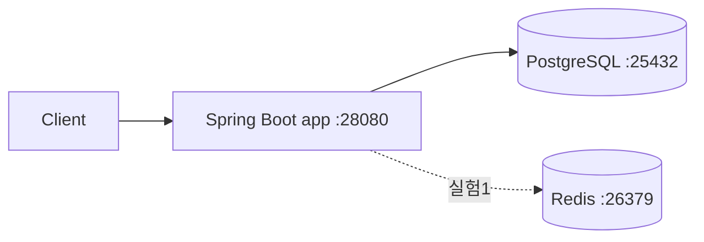

# URL 단축기 (URL Shortener)

책 8장 실습. 긴 URL 을 7자리 Base62 키로 단축하고 302 리다이렉트로 원본 URL 로 돌려보내는 서비스를 직접 구현하며 읽기/쓰기 경로의 실측 지연을 비교한다.

> 책 8장 전체 요약과 의사결정 포인트는 [NOTES.md](NOTES.md) 에 별도로 정리되어 있다. 이 README 는 **실제 구현·벤치·회고 수치** 를 담는 용도다.

## 스택

- **언어/프레임워크**: Java 17 / Spring Boot 3.3.4 (Gradle)
- **인프라**: PostgreSQL 16, Redis 7 (Redis 는 실험 1 에서만 사용)
- **벤치 도구**: hey (+ `bench/summarize.py` 로 차트 생성)

## 요구사항 정의

### 기능 요구사항
- `POST /shorten { "longUrl": "..." }` → `{ "shortUrl": "..." }` 발급
- `GET /{shortKey}` → 302 Location 으로 원본 URL 리다이렉트
- 존재하지 않는 키 조회 시 404

### 비기능 요구사항
- 읽기 경로가 주력 — 읽기:쓰기 ≈ 10:1 가정
- 302 를 유지해 모든 클릭이 서버를 지나감 (벤치마크 의미 확보)
- 단일 노드에서 동작, 수평 확장은 이 챕터에서 다루지 않음

### 명시적 비범위
- 클릭 분석 / 만료 / 커스텀 별칭
- Rate limiter (2번 챕터에서 분리)
- 분산 Unique ID 생성기 (7번 챕터에서 분리) — 이번 챕터는 DB auto-increment 기반

## 개략적 규모 추정

| 항목 | 값 |
|---|---|
| 가정 DAU | (합의 후 기입) |
| 쓰기 QPS | (축소 시나리오) |
| 읽기 QPS | 쓰기 × 10 |
| 10년 레코드 | 62^7 ≈ 3.5조 중 일부 |
| 키 길이 | 7자리 Base62 |

## 상위 설계



## MVP 및 확장 실험

- **MVP** — Spring Boot + PostgreSQL, Base62(DB auto-increment), 302 리다이렉트, **캐시 없음**
- **실험 1** — Redis 캐시 레이어 추가 → 읽기 p50/p95/p99 비교
- **실험 2** — 키 생성 전략 교체 (`KEY_STRATEGY=hash`) → 쓰기 p99 비교
- **실험 3** — long_url 중복 검사 (Bloom filter 또는 DB index) → 쓰기 처리량 변화

확장 실험은 `CACHE_ENABLED`, `KEY_STRATEGY` 플래그로 동일 바이너리에서 전환한다.

## 포트 맵

다른 챕터와 충돌하지 않도록 **2xxxx 대역** 을 사용한다 (scaling-foundations 는 1xxxx 대역 사용 중).

| 서비스 | 내부 포트 | 외부 포트 |
|---|---|---|
| app | 8080 | 28080 |
| postgres | 5432 | 25432 |
| redis | 6379 | 26379 |

## 환경 변수 (`.env`)

```bash
cp .env.example .env
```

| 변수 | 설명 | 예시 값 | 사용처 |
|---|---|---|---|
| `POSTGRES_USER` | DB 사용자 | `app` | postgres, app |
| `POSTGRES_PASSWORD` | DB 비밀번호 | `<secret>` | postgres, app |
| `POSTGRES_DB` | DB 이름 | `url_shortener` | postgres, app |
| `CACHE_ENABLED` | Redis 읽기 캐시 사용 여부 (실험 1 토글) | `false` / `true` | app |
| `KEY_STRATEGY` | 키 생성 전략 (실험 2 토글) | `base62` / `hash` | app |

## 실행 방법

```bash
# 0. .env 준비 (최초 1회)
cp .env.example .env

# 1. 인프라 + 앱 기동 (docker 이미지 빌드 포함)
make up

# 2. 헬스체크
curl http://localhost:28080/health

# 3. 로컬 JVM 으로 앱만 실행하고 싶을 때 (인프라는 docker 로 띄운 상태)
make run

# 4. 테스트 / 벤치 / 정리
make test
make bench
make down
make clean
```

## 벤치마크 결과

| 시나리오 | 동시성 | 지속시간 | RPS | p50 | p95 | p99 | 에러율 |
|---|---|---|---|---|---|---|---|
| MVP (캐시 X) | | | | | | | |
| 실험1 (Redis 캐시) | | | | | | | |
| 실험2 (hash 전략) | | | | | | | |
| 실험3 (중복검사) | | | | | | | |

## 의사결정과 트레이드오프

- (구현 진행하며 채움)

## 막힌 지점과 해결

- (구현 진행하며 채움)

## 배운 것

- (구현 진행하며 채움)

## 다음에 시도할 것

- (구현 진행하며 채움)
