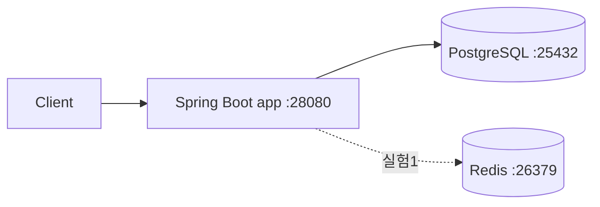

# URL 단축기 (URL Shortener)

책 8장 실습. 긴 URL 을 7자리 Base62 키로 단축하고 302 리다이렉트로 원본 URL 로 돌려보내는 서비스를 직접 구현하며 읽기/쓰기 경로의 실측 지연을 비교한다.

> 책 8장 전체 요약과 의사결정 포인트는 [NOTES.md](NOTES.md) 에 별도로 정리되어 있다. 이 README 는 **실제 구현·벤치·회고 수치** 를 담는 용도다.

## 스택

- **언어/프레임워크**: Java 17 / Spring Boot 3.3.4 (Gradle)
- **인프라**: PostgreSQL 16, Redis 7 (Redis 는 실험 1 에서만 사용)
- **벤치 도구**: hey (+ `bench/summarize.py` 로 차트 생성)

## 요구사항 정의

### 기능 요구사항
- `POST /shorten { "longUrl": "..." }` → `{ "shortUrl": "..." }` 발급
- `GET /{shortKey}` → 302 Location 으로 원본 URL 리다이렉트
- 존재하지 않는 키 조회 시 404

### 비기능 요구사항
- 읽기 경로가 주력 — 읽기:쓰기 ≈ 10:1 가정
- 302 를 유지해 모든 클릭이 서버를 지나감 (벤치마크 의미 확보)
- 단일 노드에서 동작, 수평 확장은 이 챕터에서 다루지 않음

### 명시적 비범위
- 클릭 분석 / 만료 / 커스텀 별칭
- Rate limiter (2번 챕터에서 분리)
- 분산 Unique ID 생성기 (7번 챕터에서 분리) — 이번 챕터는 DB auto-increment 기반

## 개략적 규모 추정

| 항목 | 값 |
|---|---|
| 가정 DAU | (합의 후 기입) |
| 쓰기 QPS | (축소 시나리오) |
| 읽기 QPS | 쓰기 × 10 |
| 10년 레코드 | 62^7 ≈ 3.5조 중 일부 |
| 키 길이 | 7자리 Base62 |

## 상위 설계



## MVP 및 확장 실험

- **MVP** — Spring Boot + PostgreSQL, Base62(DB auto-increment), 302 리다이렉트, **캐시 없음**
- **실험 1** — Redis 캐시 레이어 추가 → 읽기 p50/p95/p99 비교
- **실험 2** — 키 생성 전략 교체 (`KEY_STRATEGY=hash`) → 쓰기 p99 비교
- **실험 3** — long_url 중복 검사 (Bloom filter 또는 DB index) → 쓰기 처리량 변화

확장 실험은 `CACHE_ENABLED`, `KEY_STRATEGY` 플래그로 동일 바이너리에서 전환한다.

## 포트 맵

다른 챕터와 충돌하지 않도록 **2xxxx 대역** 을 사용한다 (scaling-foundations 는 1xxxx 대역 사용 중).

| 서비스 | 내부 포트 | 외부 포트 |
|---|---|---|
| app | 8080 | 28080 |
| postgres | 5432 | 25432 |
| redis | 6379 | 26379 |

## 환경 변수 (`.env`)

```bash
cp .env.example .env
```

| 변수 | 설명 | 예시 값 | 사용처 |
|---|---|---|---|
| `POSTGRES_USER` | DB 사용자 | `app` | postgres, app |
| `POSTGRES_PASSWORD` | DB 비밀번호 | `<secret>` | postgres, app |
| `POSTGRES_DB` | DB 이름 | `url_shortener` | postgres, app |
| `CACHE_ENABLED` | Redis 읽기 캐시 사용 여부 (실험 1 토글) | `false` / `true` | app |
| `KEY_STRATEGY` | 키 생성 전략 (실험 2 토글) | `base62` / `hash` | app |

## 실행 방법

```bash
# 0. .env 준비 (최초 1회)
cp .env.example .env

# 1. 인프라 + 앱 기동 (docker 이미지 빌드 포함)
make up

# 2. 헬스체크
curl http://localhost:28080/health

# 3. 로컬 JVM 으로 앱만 실행하고 싶을 때 (인프라는 docker 로 띄운 상태)
make run

# 4. 테스트 / 벤치 / 정리
make test
make bench
make down
make clean
```

## 벤치마크

### 측정 축 (A + B 동시 진행)

책의 11,600 rps 가정은 단일 노드 한계가 아니라 분산 패턴을 강제하기 위한 숫자다. 이 챕터는 그 1/100 지점 주변에서 단일 노드 변형들의 **상대적 차이** 를 측정한다. 자세한 프레이밍은 [NOTES.md §1-a](NOTES.md) 참조.

| 축 | 무엇을 보는가 |
|---|---|
| **A. 고정 부하 비교** | c=50 (책 1/100 부하 근방) 한 행만 뽑아 각 변형을 나란히 — "같은 부하에서 무엇이 변하는가" |
| **B. 포화 곡선** | c=10/50/100/200/500 전체 — "단일 노드가 어디서 무너지고 각 변경이 그 한계를 어디로 옮기는가" |

두 축은 같은 원본 데이터(`bench-results/c<N>/<variant>_<scenario>.txt`) 에서 나온다. 벤치 러너는 `VARIANT=mvp ./bench/run.sh` 식으로 실험 태그를 바꿔 가며 같은 스윕을 반복한다.

### 실행

```bash
make up              # 인프라 + 앱 기동
make bench           # MVP (VARIANT=mvp 기본값)
make bench VARIANT=cache
make bench VARIANT=hash
python3 bench/summarize.py   # summary.md + charts/*.svg 재생성
```

### MVP 베이스라인 (캐시 없음, Base62+DB auto-increment)

측정 환경: MacBook / Docker Desktop, 동일 호스트에서 hey 와 앱 · DB 동시 구동. warmup 5s, measure 20s.

| 동시성 | redirect RPS | p50 | p95 | p99 | shorten RPS | p50 | p95 | p99 | 에러 |
|---:|---:|---:|---:|---:|---:|---:|---:|---:|---:|
| c=10 | 10,112 | 0.9 | 1.6 | 2.5 | 5,626 | 1.6 | 2.7 | 4.0 | 0 |
| c=50 | 16,972 | 2.8 | 4.7 | 6.5 | **7,851** | 5.3 | 13.4 | 20.8 | 0 |
| c=100 | 17,924 | 5.2 | 8.8 | 12.6 | 7,729 | 9.7 | 34.6 | 53.8 | 0 |
| c=200 | **18,428** | 10.2 | 16.9 | 24.1 | 6,690 | 18.8 | 92.0 | 152.1 | 0 |
| c=500 | 18,133 | 25.9 | 42.4 | 59.2 | 7,220 | 49.2 | 160.1 | 239.0 | 0 |

(단위: ms)

**해석 — 측정 한 번에 이미 보이는 것**

1. **책의 11,600 rps 가정은 단일 노드 한계가 아니다.** redirect 가 c=50 만 되어도 **17k rps**, c=200 에서 **18.4k rps** 로 천장. 즉 노트북 한 대가 이미 책 전체 읽기 목표를 초과. 샤딩·복제·LB 의 존재 이유는 "한 대로 안 되어서"가 아니라 "고가용성·지리 분산·격리" 때문이라는 게 수치로 확인됨.
2. **shorten 은 c=50 에서 7,851 rps 로 포화 후 퇴보** — c=200 에서 6,690 rps 로 오히려 **감소**. DB 쓰기 경로(`nextval` + `INSERT` 왕복 2회) 가 먼저 무너지는 포화 후 스래싱. 단일 노드에서도 쓰기 목표(책의 1,160 wps) 는 7× 여유.
3. **redirect p99 는 선형 증가(2.5 → 59 ms) 하지만 RPS 는 평탄** — Little's law 전형(고정 throughput 에서 동시성↑ = 대기시간↑).
4. **캐시가 없는데도 redirect 가 shorten 대비 ~2.3× 빠름** — 단일 `SELECT long_url` + unique index lookup 이기 때문. 여기에 Redis 를 얹으면 **p99 개선보단 DB 부하 감소** 가 주 효과일 것으로 예상 (실험 1 의 가설).

차트는 `bench-results/charts/{rps,p95,errors}.svg` 에 자동 생성됨. `summary.md` 에 동시성별 전체 표가 동시 생성됨.

### 실험별 결과

| 실험 | 상태 | RPS 변화 | p99 변화 | 비고 |
|---|---|---|---|---|
| MVP (캐시 X, base62) | ✅ 측정 완료 | 위 표 참조 | 위 표 참조 | 베이스라인 |
| 실험1 (Redis 캐시) | ⬜ 대기 | | | 가설: 캐시 hit ratio ≈ 1 에서 redirect p99 가 DB 경로 대비 얼마나 줄어드는지 |
| 실험2 (hash 전략) | ⬜ 대기 | | | 가설: 쓰기 경로에 DB lookup 이 추가되어 shorten p99 가 증가 |
| 실험3 (Bloom filter 중복검사) | ⬜ 대기 | | | 가설: 쓰기 처리량이 Bloom 조회 비용만큼만 감소, 중복 URL 재사용 시 오히려 증가 |

## 의사결정과 트레이드오프

- (구현 진행하며 채움)

## 막힌 지점과 해결

- (구현 진행하며 채움)

## 배운 것

- (구현 진행하며 채움)

## 다음에 시도할 것

- (구현 진행하며 채움)
