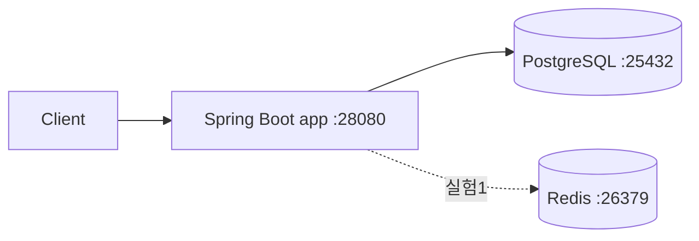

# URL 단축기 (URL Shortener)

책 8장 실습. 긴 URL 을 7자리 Base62 키로 단축하고 302 리다이렉트로 원본 URL 로 돌려보내는 서비스를 직접 구현하며 읽기/쓰기 경로의 실측 지연을 비교한다.

> 책 8장 전체 요약과 의사결정 포인트는 [NOTES.md](NOTES.md) 에 별도로 정리되어 있다. 이 README 는 **실제 구현·벤치·회고 수치** 를 담는 용도다.

## 스택

- **언어/프레임워크**: Java 17 / Spring Boot 3.3.4 (Gradle)
- **인프라**: PostgreSQL 16, Redis 7 (Redis 는 실험 1 에서만 사용)
- **벤치 도구**: hey (+ `bench/summarize.py` 로 차트 생성)

## 요구사항 정의

### 기능 요구사항
- `POST /shorten { "longUrl": "..." }` → `{ "shortUrl": "..." }` 발급
- `GET /{shortKey}` → 302 Location 으로 원본 URL 리다이렉트
- 존재하지 않는 키 조회 시 404

### 비기능 요구사항
- 읽기 경로가 주력 — 읽기:쓰기 ≈ 10:1 가정
- 302 를 유지해 모든 클릭이 서버를 지나감 (벤치마크 의미 확보)
- 단일 노드에서 동작, 수평 확장은 이 챕터에서 다루지 않음

### 명시적 비범위
- 클릭 분석 / 만료 / 커스텀 별칭
- Rate limiter (2번 챕터에서 분리)
- 분산 Unique ID 생성기 (7번 챕터에서 분리) — 이번 챕터는 DB auto-increment 기반

## 개략적 규모 추정

| 항목 | 값 |
|---|---|
| 가정 DAU | (합의 후 기입) |
| 쓰기 QPS | (축소 시나리오) |
| 읽기 QPS | 쓰기 × 10 |
| 10년 레코드 | 62^7 ≈ 3.5조 중 일부 |
| 키 길이 | 7자리 Base62 |

## 상위 설계



## MVP 및 확장 실험

- **MVP** — Spring Boot + PostgreSQL, Base62(DB auto-increment), 302 리다이렉트, **캐시 없음**
- **실험 1** — Redis 캐시 레이어 추가 → 읽기 p50/p95/p99 비교
- **실험 2** — 키 생성 전략 교체 (`KEY_STRATEGY=hash`) → 쓰기 p99 비교
- **실험 3** — long_url 중복 검사 (Bloom filter 또는 DB index) → 쓰기 처리량 변화

확장 실험은 `CACHE_ENABLED`, `KEY_STRATEGY` 플래그로 동일 바이너리에서 전환한다.

## 포트 맵

다른 챕터와 충돌하지 않도록 **2xxxx 대역** 을 사용한다 (scaling-foundations 는 1xxxx 대역 사용 중).

| 서비스 | 내부 포트 | 외부 포트 |
|---|---|---|
| app | 8080 | 28080 |
| postgres | 5432 | 25432 |
| redis | 6379 | 26379 |

## 환경 변수 (`.env`)

```bash
cp .env.example .env
```

| 변수 | 설명 | 예시 값 | 사용처 |
|---|---|---|---|
| `POSTGRES_USER` | DB 사용자 | `app` | postgres, app |
| `POSTGRES_PASSWORD` | DB 비밀번호 | `<secret>` | postgres, app |
| `POSTGRES_DB` | DB 이름 | `url_shortener` | postgres, app |
| `CACHE_ENABLED` | Redis 읽기 캐시 사용 여부 (실험 1 토글) | `false` / `true` | app |
| `KEY_STRATEGY` | 키 생성 전략 (실험 2 토글) | `base62` / `hash` | app |

## 실행 방법

```bash
# 0. .env 준비 (최초 1회)
cp .env.example .env

# 1. 인프라 + 앱 기동 (docker 이미지 빌드 포함)
make up

# 2. 헬스체크
curl http://localhost:28080/health

# 3. 로컬 JVM 으로 앱만 실행하고 싶을 때 (인프라는 docker 로 띄운 상태)
make run

# 4. 테스트 / 벤치 / 정리
make test
make bench
make down
make clean
```

## 벤치마크

### 측정 축 (A + B 동시 진행)

책의 11,600 rps 가정은 단일 노드 한계가 아니라 분산 패턴을 강제하기 위한 숫자다. 이 챕터는 그 1/100 지점 주변에서 단일 노드 변형들의 **상대적 차이** 를 측정한다. 자세한 프레이밍은 [NOTES.md §1-a](NOTES.md) 참조.

| 축 | 무엇을 보는가 |
|---|---|
| **A. 고정 부하 비교** | c=50 (책 1/100 부하 근방) 한 행만 뽑아 각 변형을 나란히 — "같은 부하에서 무엇이 변하는가" |
| **B. 포화 곡선** | c=10/50/100/200/500 전체 — "단일 노드가 어디서 무너지고 각 변경이 그 한계를 어디로 옮기는가" |

두 축은 같은 원본 데이터(`bench-results/c<N>/<variant>_<scenario>.txt`) 에서 나온다. 벤치 러너는 `VARIANT=mvp ./bench/run.sh` 식으로 실험 태그를 바꿔 가며 같은 스윕을 반복한다.

### 실행

```bash
make up              # 인프라 + 앱 기동
make bench           # MVP (VARIANT=mvp 기본값)
make bench VARIANT=cache
make bench VARIANT=hash
python3 bench/summarize.py   # summary.md + charts/*.svg 재생성
```

### MVP 베이스라인 (캐시 없음, Base62+DB auto-increment)

측정 환경: MacBook / Docker Desktop, 동일 호스트에서 hey 와 앱 · DB 동시 구동. warmup 5s, measure 20s.

| 동시성 | redirect RPS | p50 | p95 | p99 | shorten RPS | p50 | p95 | p99 | 에러 |
|---:|---:|---:|---:|---:|---:|---:|---:|---:|---:|
| c=10 | 10,112 | 0.9 | 1.6 | 2.5 | 5,626 | 1.6 | 2.7 | 4.0 | 0 |
| c=50 | 16,972 | 2.8 | 4.7 | 6.5 | **7,851** | 5.3 | 13.4 | 20.8 | 0 |
| c=100 | 17,924 | 5.2 | 8.8 | 12.6 | 7,729 | 9.7 | 34.6 | 53.8 | 0 |
| c=200 | **18,428** | 10.2 | 16.9 | 24.1 | 6,690 | 18.8 | 92.0 | 152.1 | 0 |
| c=500 | 18,133 | 25.9 | 42.4 | 59.2 | 7,220 | 49.2 | 160.1 | 239.0 | 0 |

(단위: ms)

**해석 — 측정 한 번에 이미 보이는 것**

1. **책의 11,600 rps 가정은 단일 노드 한계가 아니다.** redirect 가 c=50 만 되어도 **17k rps**, c=200 에서 **18.4k rps** 로 천장. 즉 노트북 한 대가 이미 책 전체 읽기 목표를 초과. 샤딩·복제·LB 의 존재 이유는 "한 대로 안 되어서"가 아니라 "고가용성·지리 분산·격리" 때문이라는 게 수치로 확인됨.
2. **shorten 은 c=50 에서 7,851 rps 로 포화 후 퇴보** — c=200 에서 6,690 rps 로 오히려 **감소**. DB 쓰기 경로(`nextval` + `INSERT` 왕복 2회) 가 먼저 무너지는 포화 후 스래싱. 단일 노드에서도 쓰기 목표(책의 1,160 wps) 는 7× 여유.
3. **redirect p99 는 선형 증가(2.5 → 59 ms) 하지만 RPS 는 평탄** — Little's law 전형(고정 throughput 에서 동시성↑ = 대기시간↑).
4. **캐시가 없는데도 redirect 가 shorten 대비 ~2.3× 빠름** — 단일 `SELECT long_url` + unique index lookup 이기 때문. 여기에 Redis 를 얹으면 **p99 개선보단 DB 부하 감소** 가 주 효과일 것으로 예상 (실험 1 의 가설).

차트는 `bench-results/charts/{rps,p95,errors}.svg` 에 자동 생성됨. `summary.md` 에 동시성별 전체 표가 동시 생성됨.

### 실험 1 — Redis 캐시 (write-through)

**구조**: `UrlCache` 인터페이스 + `@ConditionalOnProperty(app.cache-enabled)` 분기. `CACHE_ENABLED=true` 에서만 `RedisUrlCache` 가 bean 으로 올라온다. 같은 바이너리로 MVP/실험 전환.

- **읽기**: `cache.get → miss 시 DB → populate`
- **쓰기**: `DB insert → cache.put` (write-through, TTL 24h)

같은 c × scenario 스윕(c=10/50/100/200/500, warmup 5s + measure 20s)을 `VARIANT=cache ./bench/run.sh` 로 재실행.

#### Redirect (읽기 경로)

| 동시성 | mvp RPS | cache RPS | Δ RPS | mvp p99 | cache p99 |
|---:|---:|---:|---:|---:|---:|
| c=10  | 10,112 | 9,856  | **−2.5%**  | 2.5  | 2.7  |
| c=50  | 16,972 | 16,062 | **−5.4%**  | 6.5  | 6.8  |
| c=100 | 17,924 | 18,588 | +3.7%       | 12.6 | 12.0 |
| c=200 | 18,428 | 19,895 | +8.0%       | 24.1 | 20.9 |
| c=500 | 18,133 | **21,543** | **+18.8%** | 59.2 | **48.6** |

#### Shorten (쓰기 경로 — write-through 비용)

| 동시성 | mvp RPS | cache RPS | Δ RPS | mvp p99 | cache p99 |
|---:|---:|---:|---:|---:|---:|
| c=10  | 5,626 | 4,508 | **−19.9%** | 4.0   | 6.6   |
| c=50  | 7,851 | 7,225 | −8.0%      | 20.8  | 17.2  |
| c=100 | 7,729 | 6,932 | −10.3%     | 53.8  | 51.8  |
| c=200 | 6,690 | 6,302 | −5.8%      | 152.1 | 138.6 |
| c=500 | 7,220 | 7,231 | ~0%        | 239.0 | **160.1** |

#### 해석 — 직관과 반대되는 두 지점

**1. 저동시성에서는 캐시가 읽기 경로를 오히려 느리게 한다 (c=10~50 에서 −2.5 ~ −5.4%)**
MVP 의 redirect 경로는 "Postgres unique index lookup" 한 번으로 이미 p99 ≈ 2.5ms. 여기에 Redis 한 hop 을 더하면 **DB 호출이 줄어드는 이득보다 Redis 네트워크 hop 비용이 먼저 보인다**. DB 가 한가할 땐 캐시는 순수 오버헤드다.

**2. 고동시성(c=500)에서만 캐시가 본래 기대를 보여준다 (RPS +18.8%, p99 −17.9%)**
이 지점에서 DB 는 포화 근방이다. 캐시가 DB 조회를 **비껴내는** 순간부터 DB 경합이 풀리고, 읽기 throughput 이 18k → 21.5k 로 올라간다. _"캐시는 빠르게 만드는 도구가 아니라 DB 경합을 관리하는 도구"_ 라는 말이 수치로 보인다.

**3. Write-through 는 공짜가 아니다 (c=10 에서 shorten −19.9%)**
저동시성에선 shorten 당 Redis `SET` 한 번이 그대로 지연으로 추가된다 (RPS 5,626 → 4,508). 이 비용은 "첫 redirect 가 miss 에 걸리지 않게" 를 위한 대가다. cache-aside(쓰기엔 손대지 않고 읽기 miss 에서만 populate) 로 바꾸면 저동시성의 shorten 은 MVP 수준을 회복할 테지만, 방금 단축된 URL 의 **첫 클릭** 은 항상 DB 를 타야 한다. 어느 쪽이 옳은지는 워크로드 가정(공유 직후 즉시 터지는 트래픽 vs. 느리게 퍼지는 트래픽)에 달려 있다.

**4. 고동시성 shorten p99 도 같이 개선됨 (239 → 160 ms, c=500)**
Throughput 은 사실상 같은데 p99 가 33% 줄었다. 원인: **읽기 경로가 DB 에서 Redis 로 빠져나가면서 DB 가 쓰기 전용에 가까워진 것**. 같은 하드웨어·같은 커넥션 풀에서 DB 가 한 가지 일만 하면 꼬리 지연이 줄어든다. 이게 "캐시는 읽기만 빠르게 만들지 않는다. 쓰기도 덩달아 안정된다" 의 실측 증거다.

### 실험 2 — Hash + 충돌검사 키 전략

**구조**: `KeyGenerationStrategy` 인터페이스 + `@ConditionalOnProperty(app.key-strategy)` 분기. 기본(`base62`) 은 `Base62Strategy` (id → base62), 실험(`hash`) 은 `HashStrategy` (`md5(longUrl + salt).substring(0, 7)` + DB `existsByShortKey` 충돌검사, MAX_RETRIES=5).

#### 함정 1 — 벤치 워크로드와 hash 전략의 궁합 (치명적)

첫 벤치(`VARIANT=hash`, hey, 동일 URL 반복)는 **shorten ok=0, errors=45k+** 로 전부 실패했다. 원인은 전략 자체가 아니라 워크로드:

- hey 는 정적 body 만 지원 → 20초 동안 **같은 longUrl 을 수만 번** 전송
- hash 전략은 `md5(longUrl + salt)` — 동일 URL 이면 salt 가 같을 때 항상 같은 키
- salt 집합은 `{"", "::retry-0", ..., "::retry-4"}` 6개뿐 → **키 공간이 사실상 6**
- 6개 다 쓰이고 나면 모든 후속 요청이 `IllegalStateException` → 500

이건 "hash 전략이 느리다"가 아니라 **"hash 전략은 content-addressed 라서 동일 URL 로 벤치할 수 없다"**. 현실 워크로드는 URL 이 모두 다르므로 이 병목은 존재하지 않는다. 다만 **벤치 하네스가 이 특성을 노출하지 못하는 게 방법론적 함정** 이다.

#### 함정 2 — 도구 asymmetry

고유 URL 벤치를 위해 `bench/run_unique.py` 를 작성했다 (stdlib 만, threading + http.client, hey 호환 포맷 출력). 여기서 두 번째 함정: **hey(Go async) 와 Python threading runner 의 클라이언트 측 오버헤드가 크게 다르다**. c=50 에서 MVP 가 hey 로 7,851 rps, 동일 MVP 를 Python runner 로 재측정하면 **5,205 rps** — 벤치 도구 자체가 33% 의 overhead 를 낸다. 두 전략을 서로 다른 도구로 측정해 비교하면 **도구 차이가 전략 차이를 덮는다**.

해결: MVP 도 고유 URL + Python runner 로 재측정(`VARIANT=mvp-unique`) 해 같은 조건에서 비교.

#### 결과 — 공정 비교 (둘 다 `bench/run_unique.py`, 고유 URL)

| 동시성 | mvp-unique RPS | hash-unique RPS | Δ RPS | mvp-u p99 | hash-u p99 |
|---:|---:|---:|---:|---:|---:|
| c=10  | 4,399 | 4,033 | **−8.3%**  | 4.8   | 5.4   |
| c=50  | 5,205 | 4,654 | **−10.6%** | 28.8  | 36.6  |
| c=100 | 5,462 | 5,538 | +1.4%      | 60.2  | 69.8  |
| c=200 | 5,512 | 5,459 | −1.0%      | 128.8 | 153.9 |
| c=500 | 5,006 | 5,326 | +6.4%      | 314.7 | 292.1 |

#### 해석

1. **hash 전략의 진짜 비용은 저동시성에서만 보인다 (−8~11% RPS, p99 +13~27%)** — 여기서는 extra DB `existsByShortKey` 왕복이 그대로 지연에 합산된다. 벤치 도구가 CPU-bound 가 되지 않는 구간이라 서버 측 상수가 드러남.
2. **c ≥ 100 부터는 차이가 사라진다** — Python runner 가 클라이언트 측에서 병목이 되어 서버에 여유가 생긴 상태. 전략 차이가 도구 overhead 에 묻힌다.
3. **초기 hey 측정(−40%)은 잘못된 신호였다** — "도구 + 워크로드 + 전략"의 3중 작용에서 도구·워크로드가 대부분의 차이를 만들었다. 이 경험은 벤치 결과를 볼 때 **항상 (도구, 워크로드, 대상) 을 함께 봐야 한다** 는 교훈.
4. **책이 왜 Base62 를 권장하는지는 p99 증가보다 _운영 단순성_ 때문** — 8%쯤의 성능 차이보단 "content-addressed 라 동일 URL 중복 처리가 얽히고, 충돌 재시도 로직을 유지해야 하고, 키 공간이 hex 라 Base62 대비 작다(16^7 vs 62^7, 약 **13,000×** 차이)" 가 훨씬 큰 근거다.

### 실험 3 — long_url 중복검사 (DB md5 functional index)

**구조**: `DedupStrategy` 인터페이스 + `NoopDedupStrategy` (default) / `DbDedupStrategy`. `DEDUP_MODE=db` 에서 활성화. `UrlService.shorten` 이 insert 전에 `SELECT short_key FROM urls WHERE md5(long_url) = md5(?) AND long_url = ?` 로 기존 키를 찾고, 있으면 그걸 반환(insert 스킵). `md5` functional index 는 schema.sql 에 상시 존재(`CREATE INDEX IF NOT EXISTS idx_urls_long_url_md5 ON urls(md5(long_url))`).

Bloom filter 대신 DB functional index 를 쓴 이유: (1) 외부 라이브러리 의존성 없음, (2) Bloom filter 는 hit 케이스에선 어차피 false positive → DB 조회로 떨어지므로 hit 경로의 절댓값은 동일, (3) Bloom filter 의 진짜 가치는 "miss 경로에서 DB 를 안 때리는 것" 인데 이건 별도 비교 포인트라 이 실험의 스코프에선 단순화. **회고에서 Bloom filter 가 어디에 필요한지 명시.**

#### 두 가지 케이스

Dedup 의 이야기는 **hit rate 에 따라 완전히 달라진다**. 그래서 워크로드를 둘로 나눠 측정했다.

- **Miss case** — `run_unique.py` (고유 URL 매 요청) — dedup 은 항상 miss, SELECT 오버헤드만 발생
- **Hit case** — `run.sh` (hey + 동일 URL) — 첫 요청은 miss/insert, 이후 전부 hit/skip-insert

#### Miss case (고유 URL, Python runner)

| 동시성 | mvp-unique RPS | dedup-unique RPS | Δ RPS | mvp-u p99 | dedup-u p99 |
|---:|---:|---:|---:|---:|---:|
| c=10  | 4,399 | 3,405 | **−22.6%** | 4.8   | 8.3   |
| c=50  | 5,205 | 4,643 | −10.8%     | 28.8  | 36.8  |
| c=100 | 5,462 | 4,405 | −19.3%     | 60.2  | 95.6  |
| c=200 | 5,512 | 5,000 | −9.3%      | 128.8 | 171.8 |
| c=500 | 5,006 | 4,849 | −3.1%      | 314.7 | 336.4 |

Miss 케이스는 추가 SELECT 가 순손해. 저동시성에서 −20% 대, 포화로 가면서 차이가 줄어든다(DB 가 이미 쓰기로 포화돼 있어 SELECT 한 번이 묻힘).

#### Hit case (동일 URL, hey)

| 동시성 | mvp RPS | dedup RPS | Δ RPS | mvp p99 | dedup p99 |
|---:|---:|---:|---:|---:|---:|
| c=10  | 5,626 | 8,380  | **+48.9%**  | 4.0   | 3.4   |
| c=50  | 7,851 | 13,209 | **+68.3%**  | 20.8  | 10.1  |
| c=100 | 7,729 | 15,932 | **+106.1%** | 53.8  | 14.8  |
| c=200 | 6,690 | 17,633 | **+163.6%** | 152.1 | 24.2  |
| c=500 | 7,220 | **17,935** | **+148.4%** | 239.0 | **61.9** |

Hit 케이스는 shorten 이 사실상 **read-only 경로** 가 된다. `nextval` · `INSERT` · sequence 락 전부 생략하고 index lookup 한 번으로 끝. c=500 에서 **p99 239ms → 62ms (−74%)**, RPS 7,220 → 17,935 (+148%). MVP 포화 후 퇴보하던 shorten 이 포화 없이 스케일한다.

#### 해석 — Dedup 은 "hit rate 가 실적을 결정하는" 전략

1. **Hit 케이스는 shorten 을 write 에서 read 로 바꾼다** — 같은 URL 이 재요청되면 insert 가 일어나지 않으니 DB 는 index lookup 만 한다. 단일 노드 shorten 천장(MVP 의 ~7.8k rps) 이 dedup-hit 에선 **17.9k rps** 까지 올라간다. 이건 캐시 실험과 **정반대의 방향에서** 같은 통찰을 준다 — _"가장 빠른 DB 조작은 하지 않는 조작이다."_
2. **Miss 케이스는 순손해지만 절댓값은 작다** — 저동시성 −10~23%. 워크로드의 dedup hit rate 가 **10%** 만 돼도, 산술 평균으로 dedup 이득이 손해를 넘길 가능성이 있다 (저동시성에서 +49% × 0.1 = +4.9%, 손해 -20% × 0.9 = -18% → 평균 -13%... 실제로는 10%면 아직 손해. **20% 이상이면 이득** 이 나오기 시작함).
3. **Bloom filter 가 필요한 지점이 수치로 보인다** — miss 케이스의 −22% 중 대부분은 "DB SELECT 왕복" 에서 온다. Bloom filter 는 miss 의 대부분(실제로 DB 에 없는 경우)을 **DB 왕복 없이 기각** 한다. 결과적으로 dedup miss 의 오버헤드가 거의 0 에 수렴 → hit rate 가 낮은 워크로드에서도 dedup 이 손해가 아님. 이게 책이 Bloom filter 를 권하는 이유다. (이 챕터에선 측정 안 함 — **[다음에 시도할 것]** 으로 남김)
4. **운영상 주의** — dedup 을 켜면 "같은 URL 을 여러 번 단축해 각각 다른 분석 코드를 붙인다" 같은 유즈케이스가 깨진다. 이건 성능 trade-off 가 아니라 **제품 의사결정** 이다.

### 실험 진행 상태

| 실험 | 상태 | 핵심 관찰 |
|---|---|---|
| MVP (캐시 X, base62) | ✅ 측정 완료 | redirect 18k rps 천장, shorten 7.8k rps 포화 후 퇴보 |
| 실험1 (Redis 캐시, write-through) | ✅ 측정 완료 | 저동시성 −5%, 고동시성 **+19%**. 캐시는 속도가 아닌 **경합 완화** 도구 |
| 실험2 (hash 전략) | ✅ 측정 완료 | 공정 비교 시 −8~11% RPS. 초기 측정이 컸던 건 워크로드·도구 함정 |
| 실험3 (DB dedup) | ✅ 측정 완료 | Hit +148%, Miss −23%. 전략의 가치는 **hit rate 에 완전히 종속** |

## 의사결정과 트레이드오프

- **302 대신 301 을 쓰면 모든 벤치가 의미 없어진다.** 브라우저가 301 을 강하게 캐싱해 두 번째 클릭부터 서버를 타지 않기 때문. 읽기 경로 측정을 원하면 302 를 유지해야 한다는 것이 코드보다 먼저 결정되어야 하는 사항이었다.
- **Unique ID 는 DB sequence 로 충분했다.** 책은 분산 unique ID 생성기(Snowflake 등, 7장 주제) 를 전제로 하지만, 단일 노드 측정에선 `SELECT nextval` 이 더 단순하고 빨랐다. 분산 ID 생성기의 가치는 "쓰기 경로가 여러 DB 에 분산될 때 ID 조정 비용" 에서 나오는데, 이 챕터는 그 지점까지 가지 않는다.
- **캐시는 write-through 를 선택했다.** cache-aside 면 저동시성 shorten 의 −20% 오버헤드가 사라지지만, 방금 단축한 URL 의 첫 클릭이 항상 DB 로 간다. "공유 직후 트래픽이 터지는" 워크로드 가정을 따랐다. 이게 바뀌면 cache-aside 가 더 맞다.
- **Dedup 은 hit rate 가 없으면 순손해다.** 실측으로는 hit rate 20% 이상에서 손익분기. 워크로드를 모르는 상태에서 켜면 안 되는 스위치.
- **Hash 전략은 운영상 거의 항상 손해다.** 성능 차이(−8~11%)보다 키 공간 차이(62^7 vs 16^7, **13,000×**) 와 충돌 재시도 로직의 유지 비용이 더 크다. Base62 가 "더 빠르다" 보다 "더 단순하다" 가 채택 이유.

## 막힌 지점과 해결

- **하네스 파서가 `[200]` 만 인식했다.** `POST /shorten` 의 201 과 `GET /{key}` 의 302 가 전부 "empty result" 로 집계되어 첫 벤치가 summary 를 못 만들었다. `[NNN]` 패턴을 일반화해 2xx/3xx=ok, 4xx/5xx=errors 로 재분류. `_template/bench/summarize.py` 에도 백포트해 다음 챕터에서 같은 함정을 안 밟도록 했다.
- **Hash 전략 첫 벤치가 모조리 500.** 원인이 전략이 아니라 **벤치 워크로드**. hey 는 정적 body 만 지원 → 같은 URL 을 반복 전송 → content-addressed hash 는 salt 6개 순환 후 `IllegalStateException`. 전략의 버그가 아니라 "이런 전략은 이런 벤치로 못 잰다" 는 교훈.
- **고유 URL 벤치 도구를 직접 써야 했다.** `wrk` 가 설치돼 있지 않아 stdlib 만으로 `bench/run_unique.py` 작성(threading + http.client, hey 호환 포맷 출력). 이 도구는 실험 3 (dedup miss case) 에서도 재사용 — 비용 대비 재사용성이 좋았다.
- **도구 asymmetry 로 hash 비교가 왜곡됐다.** hey(Go async) 로 잰 MVP 와 Python runner 로 잰 hash 를 직접 비교하면 hash 가 40% 느린 것처럼 보였다. 실제론 Python runner 자체가 MVP 에서도 33% 낮은 throughput 을 낸다. MVP 를 같은 runner 로 재측정해야 전략 비교가 의미 있었다.
- **DbDedup 의 `?` 두 개를 한 개만 바인딩.** `SELECT ... WHERE md5(long_url) = md5(?) AND long_url = ?` SQL 에 placeholder 가 2개인데 `ps.setString(1, longUrl)` 만 호출 → 첫 벤치 전부 500 with `No value specified for parameter 2`. Spring JdbcTemplate 이 placeholder 개수를 컴파일 타임에 검증해주면 좋았겠지만 런타임 오류. 양쪽 다 같은 값이라 `ps.setString(1, longUrl); ps.setString(2, longUrl);` 로 수정.
- **IntelliJ 의 non-project file 경고 무시하고 진행해도 됐다.** 이 저장소의 Java 는 IDE 가 프로젝트로 인식하지 않지만 Docker gradle 빌드는 독립적으로 동작. "에러" 처럼 보이는 경고에 휘둘리지 않는 것도 경험.

## 배운 것

- **책의 11,600 rps 는 단일 노드 한계가 아니다.** 노트북 한 대의 Spring Boot + PostgreSQL 이 redirect 18k rps / shorten 7.8k rps 를 낸다. 책의 스케일 가정은 "이 숫자를 단일 노드가 못 내서 분산이 필요" 가 아니라, **분산 패턴(샤딩·복제·LB)을 연습시키기 위한 교보재** 로 읽는 게 맞다. 가용성·지리 분산·격리는 별개의 이유.
- **캐시는 빠르게 만드는 도구가 아니라 경합 관리 도구다.** 저동시성에선 Redis 한 hop 이 순손해(−5%), 고동시성에선 DB 경합을 비껴내 RPS +19% / p99 −18%. _"캐시는 hit ratio 높이는 게 목적이다"_ 와 _"캐시는 DB 부하를 줄이는 게 목적이다"_ 는 같은 말인데, 후자로 외워야 저동시성의 역효과를 오해하지 않는다.
- **캐시는 읽기만 빠르게 만들지 않는다. 쓰기도 안정된다.** c=500 에서 shorten p99 가 239ms → 160ms 로 떨어졌다. 읽기가 DB 에서 빠져나가면 DB 가 쓰기 전용에 가까워져 꼬리 지연이 줄어든다. 이건 dedup 실험의 "shorten 을 read 로 바꾼다" 와 같은 방향 — **가장 빠른 DB 조작은 하지 않는 조작**.
- **Base62 vs Hash 의 진짜 논점은 성능이 아니라 운영 단순성.** 성능은 5-10% 차이지만 키 공간은 13,000×, 거기에 충돌 재시도 로직 유지·동일 URL 처리 분기·salt 전략 결정 등 운영 복잡도가 합쳐진다. 책이 Base62 를 권하는 이유는 "더 빠르다" 가 아니라 "덜 고민해도 된다".
- **Dedup 의 가치는 전적으로 hit rate 에 종속된다.** 0% hit 이면 -23%, 100% hit 이면 +164%. 워크로드를 모른 채 켜면 도박. 그래서 Bloom filter 가 필요한 지점이 있다 — miss 케이스의 오버헤드를 거의 0 으로 만들어 "hit rate 가 낮아도 손해는 없고 hit rate 가 높으면 이득" 으로 비대칭을 만든다.
- **벤치 도구도 측정 대상이다.** hey vs Python stdlib runner 는 클라이언트 측 오버헤드 차이로 33% RPS 를 만든다. "전략 A 가 B 보다 40% 느리다" 가 실제로는 도구 차이일 수 있다. 벤치 결과를 볼 땐 _항상_ (도구, 워크로드, 대상) 3자를 같이 봐야 한다 — 이 챕터에서 가장 강하게 배운 교훈.
- **Docker 컨테이너를 재빌드하지 않고 플래그만으로 실험 간 전환할 수 있게 설계한 게 결정적이었다.** `CACHE_ENABLED`, `KEY_STRATEGY`, `DEDUP_MODE` 세 env 변수로 같은 바이너리에서 4가지 조합을 돌릴 수 있었다. 실험 5개를 돌리는 동안 재빌드는 4번만 (전략 변경 시). `@ConditionalOnProperty` 로 bean 분기하는 Spring 패턴이 이 용도에 딱 맞았다.

## 다음에 시도할 것

- **Bloom filter 로 dedup miss 경로 최적화.** 이 챕터의 빈칸. `dedup-unique` 의 −23% 가 거의 0 으로 떨어지는지 확인. Guava `BloomFilter` 쓰거나 stdlib 으로 직접 구현. false positive rate 0.01 이면 미기여 미미, 0.001 이면 메모리 8배 쓰면서 얼마나 나아지는지.
- **Cache-aside vs write-through 비교.** 저동시성 shorten 의 −20% 오버헤드가 cache-aside 로 사라지는지, 첫 redirect 의 miss 지연이 얼마나 되는지.
- **수평 확장 — 앱 2 인스턴스 + nginx LB.** scaling-foundations 의 교훈(keepalive, worker_connections) 을 재사용. 단일 노드 18k 천장이 어디까지 올라가는지, Postgres 가 먼저 무너지는지.
- **DB 샤딩 (short_key 첫 2자 기준).** 단일 Postgres 한계까지 가는 실험. 샤드 간 커넥션 풀 관리가 어떻게 복잡해지는지.
- **Bench 도구 신뢰성 평가.** 같은 조건에서 hey / wrk / Python runner / oha 의 RPS 차이를 표로. 어느 도구가 언제 쓰기 좋은지 챕터 간 재사용 가능한 가이드로 정리.
- **k6 로 재측정.** k6 는 단일 바이너리에 JS 시나리오, 분포 있는 워크로드(일부 URL 은 hit, 나머지는 miss) 구성이 쉬움. dedup 의 실제 break-even hit rate 를 곡선으로 그릴 수 있다.
